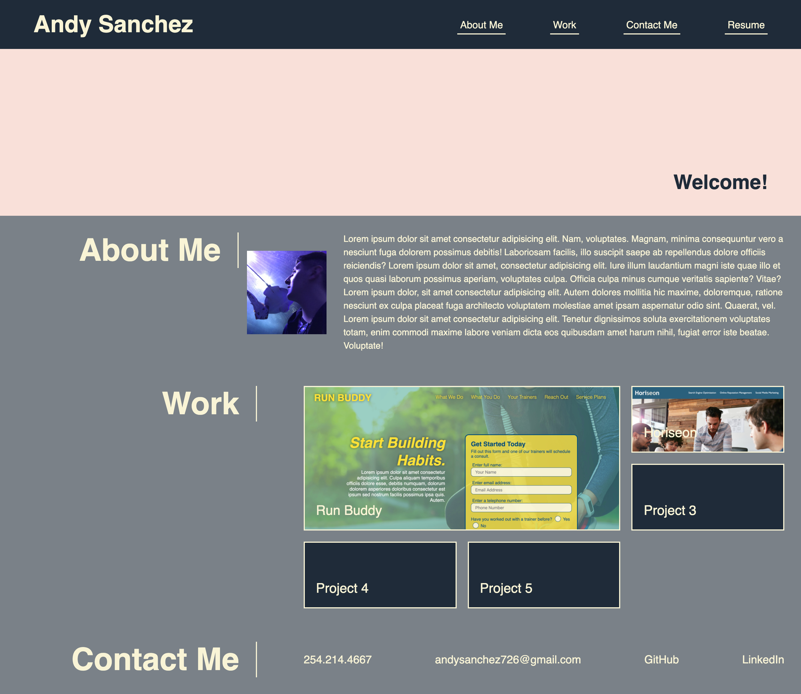

<h1 align="center"> # Dev Portfolio
</h1>

This is my repository for my dev portfolio! You can check out my changes, assets, and view the page!

Dev Portfolio - https://andysanchez726.github.io/Week-1-Challenge-Horiseon/

